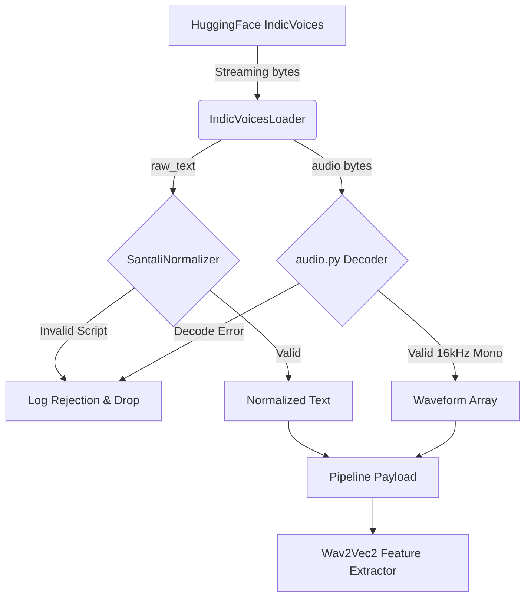

# MATRIVAANI - SANTALI ASR DATA PIPELINE

## 1. Overview
The MatriVaani ASR Data Pipeline is designed to process the `ai4bharat/IndicVoices` dataset for the Santali language (`sat`) in a strictly streaming, memory-bounded environment. The pipeline enforces a memory footprint of < 2 GB.

## 2. Components

### 2.1 IndicVoicesLoader
- **Location:** `data_modules/santali/indicvoices_loader.py`
- **Responsibility:** Yields a continuous stream of dictionaries. It handles the dynamic network streaming from Hugging Face, resolving `WinError 10038` networking constraints by explicitly casting `audio_filepath` to `datasets.Audio(decode=False)` to fetch raw byte payloads.

### 2.2 SantaliNormalizer
- **Location:** `data_modules/santali/text_normalizer.py`
- **Responsibility:** 
  1. Validates that the script is predominantly Ol Chiki (or valid mixed script).
  2. Applies NFC Unicode normalization.
  3. Strips zero-width and invisible control characters.
  4. Yields a dictionary mapping `{"original_text": ..., "normalized_text": ...}` to ensure no original transcript data is ever permanently destroyed.

### 2.3 Deterministic Audio Decoder
- **Location:** `data_modules/santali/audio.py`
- **Responsibility:** Safely parses raw `FLAC` bytes using `soundfile.read()`, avoiding the broken `torchcodec` environment on Windows. Validates that the waveform is strictly 16000 Hz, mono, and contains no NaNs or Infs.

## 3. Streaming Flow

## 4. Train/Validation Policy
- The dataset is strictly segregated according to the canonical `IndicVoices` splits: `train` and `valid`.
- **Leakage Prevention Strategy:** The loader exclusively queries `_stream_split("train")` or `_stream_split("valid")` at the Hugging Face API layer. No local shuffling or interleaving of splits is performed.
- A deterministic development subset consisting of the first 1000 train pointers and 200 validation pointers has been frozen for fast baseline experimentation.
